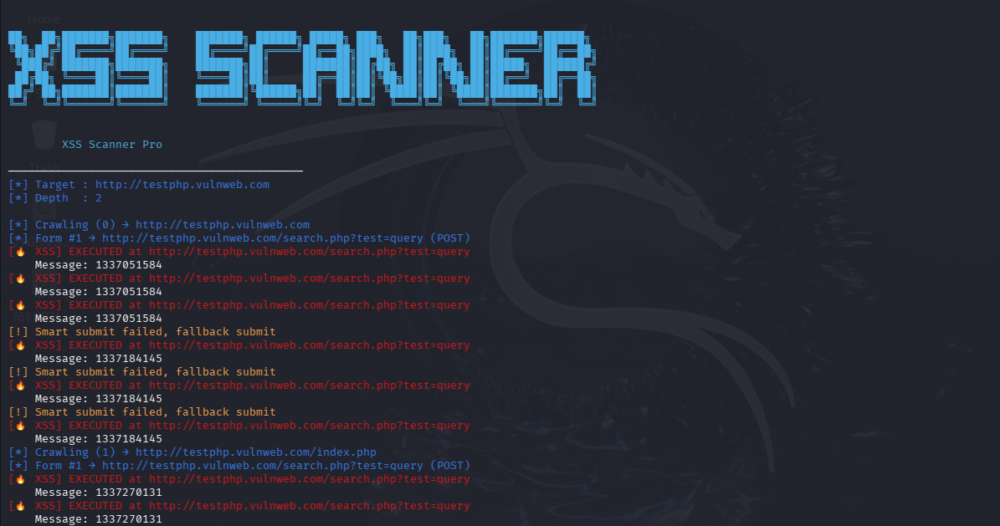

<div align="center">

# ⚡ XSS Scanner (Playwright-Based)

Modern **XSS Scanner** berbasis **Playwright** yang dirancang untuk **bug bounty hunters** dan **security researchers**.  
Tool ini melakukan **real browser–based XSS detection** melalui crawling, URL parameter injection, dan smart form submission.

This Playwright-based XSS scanner is designed for bug bounty hunters and penetration testers
to detect real-world executed cross-site scripting vulnerabilities.

> 🔥 Fokus pada **XSS yang benar-benar DIEKSEKUSI**, bukan sekadar reflected string.

</div>

---

<div align="center">



<sub>Example XSS detection result</sub>

</div>

---

## ✨ Features

- ✅ Real browser execution (Playwright + Chromium)
- ✅ URL parameter XSS scanning
- ✅ Multi-form XSS scanning
- ✅ Smart form submission (auto bypass required / validation fields)
- ✅ JavaScript dialog detection (`alert`, `prompt`)
- ✅ Recursive crawling (same domain only)
- ✅ Auto XSS report generation (`.ndjson`)
- ✅ Clean & readable CLI colored output
- ✅ Marker-based validation to avoid false positives

---

## 🧠 How It Works (High Level)

1. Crawl target website (same domain)
2. Detect URL parameters
3. Inject XSS payloads
4. Detect JavaScript dialogs (`alert`, `prompt`)
5. Parse & submit all forms intelligently
6. Fallback to raw form submission if smart submit fails
7. Save **confirmed executed XSS** to report file

> ⚠️ Only **EXECUTED XSS** will be reported.

---

## 📦 Requirements

- Python **3.8+**
- Playwright
- Chromium browser (installed via Playwright)

---

## 🚀 Installation

### 1️⃣ Clone repository

```bash
git clone https://github.com/pangeran-droid/XSS-Scanner-Pro.git
cd XSS-Scanner-Pro
```

### 2️⃣ Install dependencies

```bash
pip install -r requirements.txt
```

### 3️⃣ Install Playwright browser

```bash
playwright install chromium
```

---

## ▶️ Usage

```bash
python main.py -u https://target.com
```

### Options

| Flag | Description | Default  |
|:----:|-------------|----------|
| `-u` | Target URL  | required |
| `-d` | Crawl depth | 2        |

---

## 💣 Payload Examples

Each scan generates a unique marker using a random numeric value.  
The marker is injected into XSS payloads and verified upon execution.

```text
"><svg/onload=alert({marker})>
">
<script>alert({marker})</script>
```

---

## 📝 Output Example

```bash
[*] Crawling (0) → https://target.com
[*] Form #1 → /search (GET)
[🔥 XSS] EXECUTED at https://target.com/search?q=...
```

---

## 📂 Report File

Confirmed XSS findings will be saved automatically to:

```bash
xss_report.ndjson
```

### Example entry:

```bash
{"url":"https://target.com","marker":"1337123456","message":"1337123456"}
```

---

## ⚠️ Disclaimer

> This tool is created **for educational purposes and authorized security testing only**.  
> ❌ Do **NOT** use this tool against targets without **explicit permission**.  
>
> The author is **not responsible** for any misuse or illegal activities.

---

<div align="center">

Happy hunting 🔥

</div>
